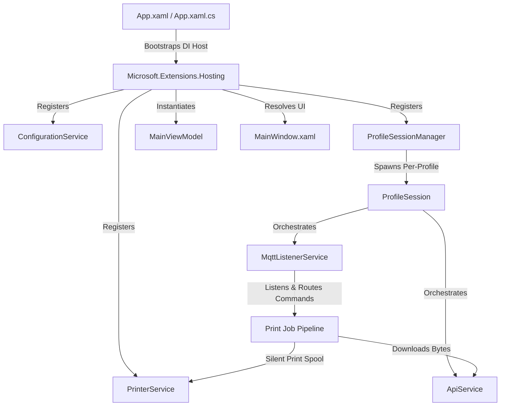
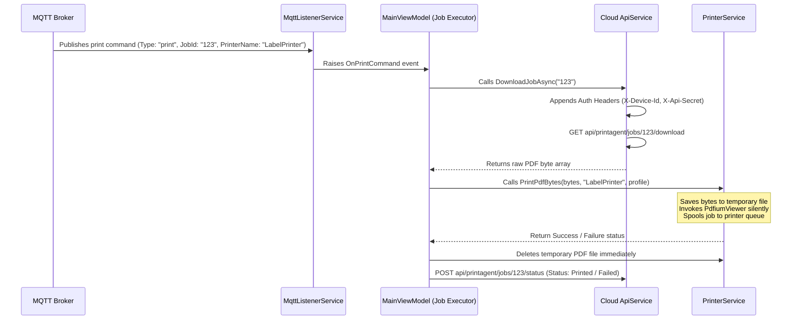

# PrintDesktopClient Project Documentation

An enterprise-grade, profile-based .NET 9.0 WPF background printing agent. It establishes parallel, persistent connections to an MQTT broker to receive remote print commands, downloads document payloads from a secure Cloud API, prints them silently with fine-grained layout/margin control, and reports print status back to the Cloud.

---

## 🚀 Key Features

*   **Multi-Profile parallel execution**: Manage and run multiple active printer-integration profiles simultaneously. Each profile maintains its own HTTP Api Client, MQTT Listener, and selected physical/network printer.
*   **Zero Data-at-Rest Print Pipeline**: Remote print commands trigger a download of PDF document bytes. These are saved to a temporary location, printed silently to the spooler, and the temporary files are securely wiped from the drive immediately.
*   **DPAPI Secure Storage**: API Secrets and MQTT passwords are encrypted locally using the Windows Data Protection API (DPAPI) on a per-profile basis. Sensitive credentials are never stored in plain text.
*   **Silent Boot & System Tray Integration**: Fully supports silent startup via the `--background` command-line argument. The app runs minimized to the notification tray (using a geometry-styled notify icon), keeping the desktop workspace clean.
*   **Single-Instance Lock**: Utilizes a named system Mutex (`PrintDesktopClient_SingleInstance`) to enforce a single running application instance.
*   **Remote Revocation (Self-Wipe)**: Automated self-wipe capability. Receipt of a remote MQTT `revoke` command or any API `401 Unauthorized` response immediately deletes DPAPI-encrypted secrets and disables the profile to secure client data.
*   **Robust Managed MQTT Connections**: Uses a Managed MQTT Client with Last Will and Testament (LWT) retained status messaging, automatic reconnect intervals, and real-time state synchronization.

---

## 🛠️ Technology Stack

| Category | Component / Library | Details & Justification |
| :--- | :--- | :--- |
| **Core Framework** | **.NET 9.0** | Targets `net9.0-windows10.0.19041.0` to support modern WinSDK integrations, including native Windows toast notification APIs. |
| **UI Framework** | **WPF (Windows Presentation Foundation)** | Offers mature, robust UI data-binding and separation of concerns via MVVM. |
| **Styling & Theme** | **MaterialDesignThemes** | Modern UI layout using Material Design cards, custom inputs, transitions, and icons. |
| **MVVM Architecture** | **CommunityToolkit.Mvvm** | Microsoft-supported MVVM framework utilizing modern C# source generators for properties and commands. |
| **MQTT Protocol** | **MQTTnet & Managed Client (v4.3.7)** | High-performance, robust library supporting auto-reconnect, MQTT v3.1.1/5.0, and QoS standards. |
| **PDF Rendering & Spooling** | **PdfiumViewer** | Integrated for silent, headless PDF printing directly to the Windows print queue without spawning external Reader instances. |
| **Secure Cryptography** | **Windows DPAPI** | Encrypts secrets using current user-level security context (`System.Security.Cryptography.ProtectedData`). |
| **System Tray UI** | **H.NotifyIcon.Wpf** | Manages notify icon, system tray context menus, and window restore behaviors. |
| **Structured Logging** | **Serilog** | Configured with File and Debug sinks writing rolling files to `%LOCALAPPDATA%\PrintDesktopClient\logs\`. |

---

## 📁 Repository Architecture

The project is structured according to clean MVVM and Dependency Injection patterns:



### Component Details

*   **Views**:
    *   `MainWindow.xaml` / `MainWindow.xaml.cs`: The master user interface. Provides a TabControl navigating between the Dashboard (Profile list, state indicators, toggle buttons) and the Profile Edit Form (configuration fields, connection testers).
    *   `PrintPreviewWindow.xaml` / `PrintPreviewWindow.xaml.cs`: Support for previewing jobs.
*   **ViewModels**:
    *   `MainViewModel.cs`: Core presenter logic. Coordinates UI state transitions, command execution, profile saves, connection testing, and triggers profile revocations.
    *   `ProfileItemViewModel.cs`: Represents individual profiles in the UI list with real-time connection status updates.
*   **Services**:
    *   `ProfileSessionManager.cs`: Orchestrates parallel profiles. Starts, stops, and restarts individual `ProfileSession` instances containing dedicated `ApiService` and `MqttListenerService` objects.
    *   `ConfigurationService.cs`: Coordinates file-based JSON settings serialization (`settings.json` in local AppData) and handles DPAPI credential protection.
    *   `ApiService.cs`: Manages all outbound HTTP communication with the Cloud Print Portal (Authorization, Printer Sync, PDF Download, and Job Status Reporting).
    *   `MqttListenerService.cs`: Subscribes to command and telemetry topics. Handles JSON parsing of incoming commands and executes legacy plain-text fallback prints.
    *   `PrinterService.cs`: Enumerate physical/virtual printers and routes document execution. Utilizes `CustomPdfPrintDocument.cs` to apply anchor-alignment and margin overrides.
    *   `NotificationService.cs`: Handles in-app snackbars and Windows toast notifications.
*   **Helpers**:
    *   `PasswordHelper.cs`: Bridges WPF `PasswordBox` securely to MVVM data bindings.

---

## ⚙️ Core Processes & Workflows

### 1. Profile Creation & Connection Verification
```
[User Input Fields] ──► [Test Connection Commands]
                              │
                              ├──► HTTP GET /health (Validate API Base URL)
                              └──► MQTT Connect & Disconnect (Validate Broker Credentials)
```
Once verified, clicking **Save** persists configuration parameters to `settings.json` and encrypts the credentials securely to local user-specific data files (e.g. `api_{profileId}.dat` and `mqtt_{profileId}.dat`).

### 2. Parallel MQTT Print Command Execution
For each active profile, the print agent listens on `devices/{DeviceAccountId}/commands` for incoming print directives.



### 3. Remote Revocation (Self-Wipe Flow)
If the API returns `401 Unauthorized` during any endpoint request, or if the broker delivers a JSON payload with `"Type": "revoke"`, the client executes a self-wipe:
1.  Terminates active HTTP requests and closes the profile's MQTT connection.
2.  Invokes `WipeCredentials()` in `ConfigurationService`.
3.  Deletes DPAPI credential storage files (`api_{profileId}.dat`, `mqtt_{profileId}.dat`).
4.  Clears the profile's authentication parameters and sets `IsEnabled = false`.
5.  Updates the UI state and logs the revocation event.

---

## 📦 Publishing & Deployment

To publish the application as a highly-optimized, single-file standalone executable for Windows deployment, run the following command in the project root:

```powershell
dotnet publish -c Release -r win-x64 --self-contained true -p:PublishSingleFile=true -p:PublishReadyToRun=true
```

### Output Artifacts
*   **Target Directory**: `bin\Release\net9.0-windows10.0.19041.0\win-x64\publish\`
*   **Executable**: `PrintDesktopClient.exe`
*   **Local AppData Path**: Settings and secure DPAPI files are created at runtime under `%LOCALAPPDATA%\PrintDesktopClient\`.
